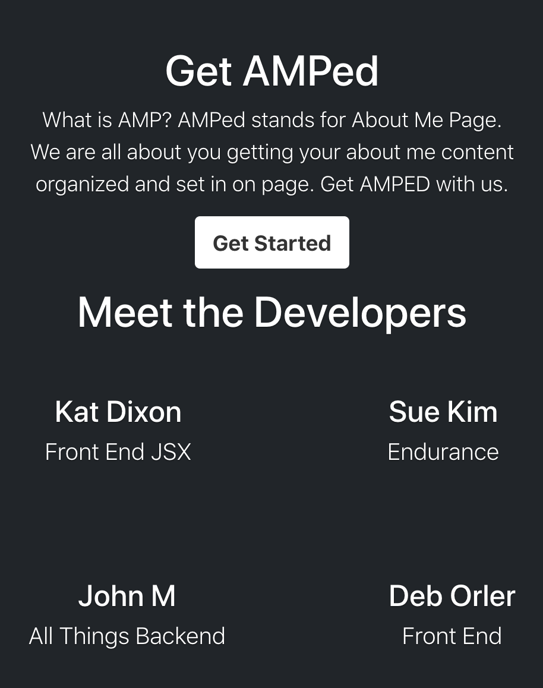

# get-AMPed
Project 3 - Creating a full-featured About Me Page (AMP)

## Description
We created get-AMPed as a tool to help user have easy access to their profiles and be able to connect it to all other softwares. IT eliminates the need to keep creating profiles for every account you create. You just use your AMP account and we take care of the rest. 

## Table of Contents

* [How it works](#how-it-works)
* [Features](#features)
* [Technoliges Used](#technologies-used)
* [Future Development](#future-development)
* [Contributors](#contributors)
* [Deployed URL](#deployed-url)

## How it works:


1. Click ***Get Started*** to sign up or login to the website
2. Sign up: User can enter username, email, password, and displayname. If the user chose not to enter the displayname, username will automatically be assigned as displayname
3. When the user visits My Page, they will see their username, displayname, about me, and links that they added
4. User can edit displayname, about me or links whenever they want IF they are in their pages after logging in
5. User can visit other user's page


## Features:
- User accounts with authentication, JWT Token
- dynamic generation of content using React
- User can visit other user's page without viewing edit buttons, aka they can modify their page only


## Technologies Used:
1. React
```javascript
import React, { useEffect, useState } from "react";
```


2. Express/Node
```javascript
const router = require('express').Router();
```


3. Mongoose
```javascript
const userLinkSchema = new Schema({
  title: {
    type: String,
    required: true
  },
  link: {
    type: String,
    required: true
  },
  description: {
    type: String
  }
});
```


4. Bootstrap


## Future Development
- Image upload for the profile
- mobile responsive design


## Contributors
[Deb Orler](https://github.com/dorler), [Kat Dixon](https://github.com/TwyllBlackleaf), [Sue Kim](https://github.com/suekimpaulsen), and [John Mohlenkamp](https://github.com/Mohlenkamp).
Please click the name to visit their GitHub.

## Deployed URL
via Heroku https://get-amped.herokuapp.com/
